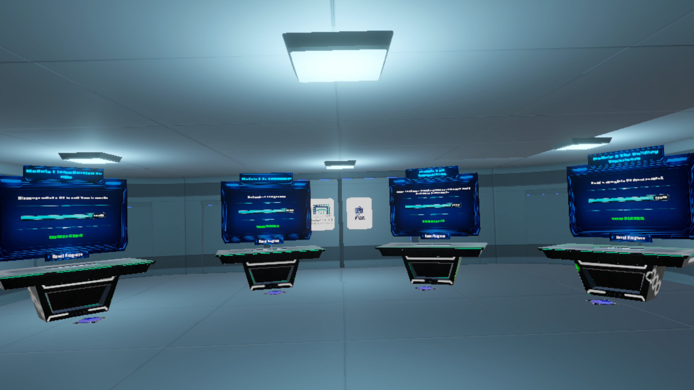
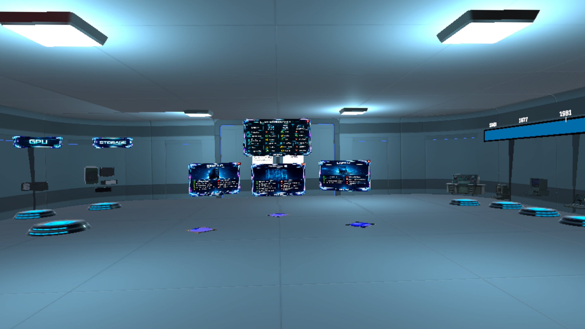
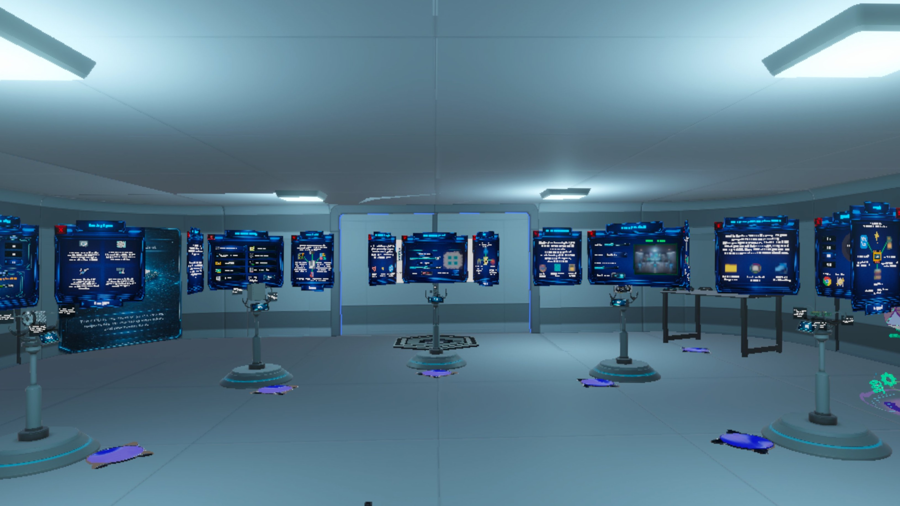
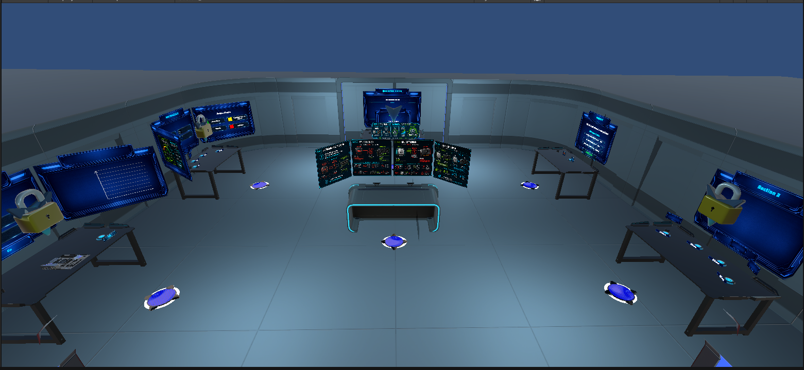
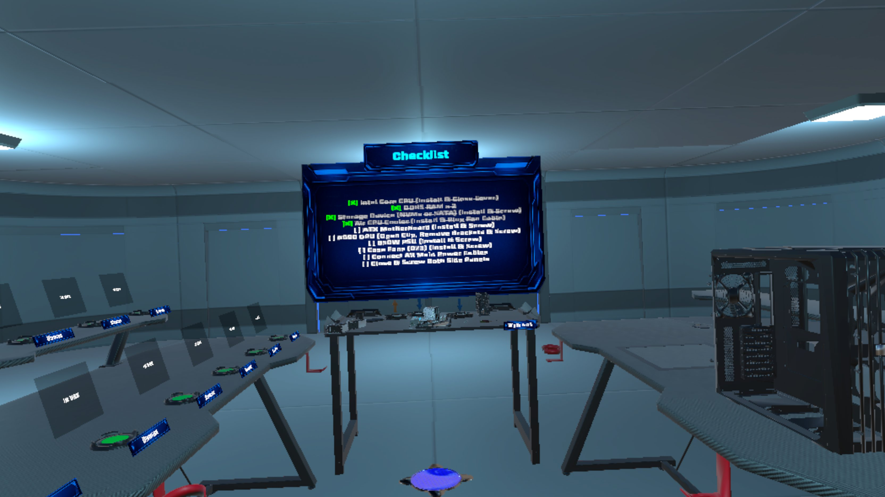
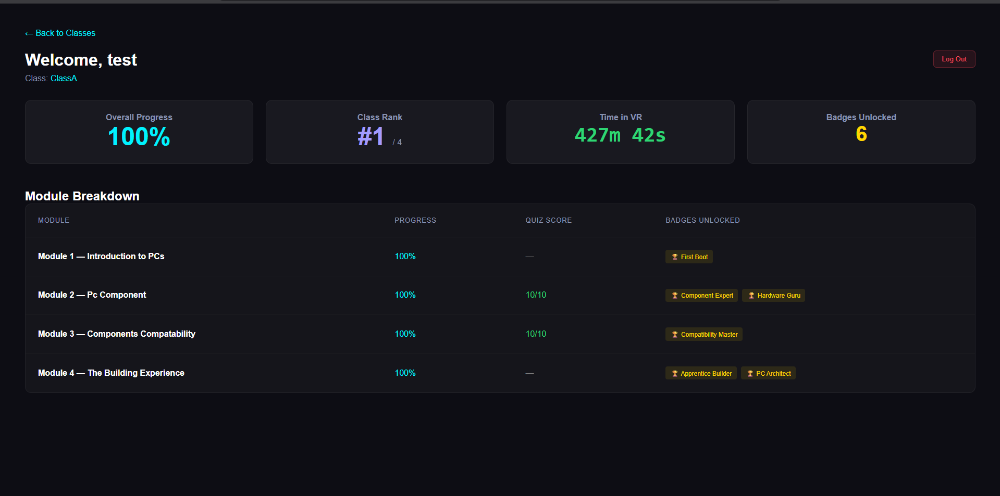
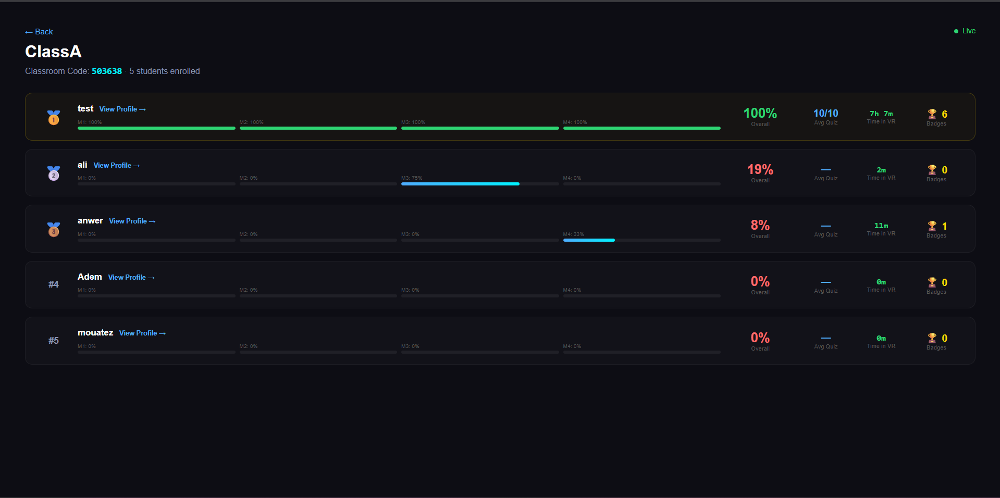

# PC Hardware Education & Assembly Training in VR

> Learn to build a PC — hands-on, in VR.


> **This is a portfolio showcase.** Full source kept private — see [Source Code Access](#source-code-access) below.

## Description

A two-platform VR educational system for teaching PC hardware and assembly, built as a final-year engineering project (PFE) during an internship at UPTAKERS. Students learn through a Unity-based VR game on Meta Quest while professors monitor live progress on a Next.js web dashboard, with the two halves synchronizing over a signed HTTP API. The standout module ends with an AI-graded build review — the student's PC layout is validated against eleven design checks and Groq (Llama 3.1) generates dynamic bilingual feedback.

## Tech Stack

| Category | Tool / Version |
|---|---|
| VR engine | Unity **6000.3.7f1** (Unity 6), URP 17.3 |
| VR runtime | OpenXR 1.16, XR Interaction Toolkit 3.3.1, XR Hands 1.7.3 |
| Target hardware | Meta Quest (Android build, .apk) |
| VR scripting | C#, Unity Input System 1.18 |
| Web frontend | Next.js 16.2, React 19.2 |
| Web backend | Next.js API routes (Node), Mongoose 9.6 |
| Database | MongoDB Atlas |
| Auth | JWT (jsonwebtoken) for web users, shared-secret header (`x-vr-api-key`) for VR headsets |
| Email | Nodemailer 8 |
| AI feedback | Groq API (`llama-3.1-8b-instant`) via REST |
| Hosting | Vercel (web dashboard), side-loaded .apk (VR) |
| Methodology | 2TUP, individual sprints over the PFE period |

## Key Features

- **Two-platform architecture** — The Unity VR client and the Next.js dashboard are independent applications that talk to each other over a versioned HTTP API. `WebIntegrationManager.cs` runs a debounced sync loop on the headset: a dirty flag (`needsSync`) is raised on any progress change, but the actual POST to `/api/vr/update` only fires every 10 seconds, with a 60-second forced sync to keep playtime metrics current even when the student is idle.
- **Sequential, narrator-gated learning (Module 1)** — A museum-style scene with three zones (PC history timeline, PC types, PC components) gated by `ZoneTrigger` colliders that are explicitly `enabled = false` until earned. Each zone's content is timed against the narrator audio — `TimelineUI.ListenToNarrator()` polls `AudioSource.time` every frame and triggers era activations when `time >= era.narratorTimestamp`, so the on-screen visuals stay perfectly in sync with the voiceover.
- **Step-by-step guided assembly with AI feedback (Module 4)** — Three separate Unity scenes (`Module4_Part1` / `_Part2` / `_Part3`) driven by `WorkshopSequencer`, `Part2Sequencer`, and `Part3Sequencer`. When the student finishes building, `BuildValidator.cs` checks the result against eleven design-doc rules (CHK-01 through CHK-11). On failure it sends the build state to Groq (Llama 3.1) and streams back a 2-3 sentence bilingual critique in character as a "PC building instructor", with hardcoded fallback feedback if the API is unavailable.
- **Bilingual EN/FR across the entire UI** — `LocalizedText.cs` subscribes to `ProgressManager.OnLanguageChanged`; switching language from the wrist menu fires one event that simultaneously refreshes every label, every `ModuleTable`, and every narration clip selection across the active scene.
- **Live professor dashboard** — Next.js 16 / React 19 app with three role-scoped login flows (superadmin, professor, student) and a separate VR auth path. Professors see per-classroom student rosters with live progress %, earned badges, and accumulated playtime; admins manage classroom rosters and invite codes.
- **Persistent, resumable progress with shared-headset support** — `ProgressManager` is a `static` class over `PlayerPrefs`, acting as the single source of truth on-device. On login `ApplyRemoteData()` reconciles with the MongoDB record; when a different student logs in on the same physical headset, `ResetSessionProgress()` wipes local state and increments a `SessionID` counter to invalidate cached narration history. Modules detect partial completion (e.g. `GetCurrentComponentIndex(0)` for Module 1) and resume players at the correct zone with all visuals restored.
- **Custom VR locomotion fixes** — `SimpleContinuousTurn.cs` works around a broken `ContinuousTurnProvider` in XRIT 3.3 by creating an `InputAction` at runtime bound directly to the right thumbstick. `LocomotionManager` is a `DontDestroyOnLoad` singleton that re-discovers locomotion components after every scene load and can hard-lock movement (including disabling the teleport ray interactor layer) during narrated sequences.
- **Achievement system synced both ways** — Seven badges stored locally as integers (`PlayerPrefs`) and as string names server-side; `WebIntegrationManager` keeps a hardcoded index→name map and pushes only newly-earned badges on each sync, while `AchievementWall.cs` greys out unearned slots in the lobby in real time as `ProgressManager` events fire.

## Screenshots

### VR — the five scenes

| Lobby | Module 1 — PC History & Components |
|---|---|
|  |  |
| **Module 2 — Component Catalog** | **Module 3 — Knowledge Quiz** |
|  |  |
| **Module 4 — Guided PC Assembly** | |
|  | |

### Web dashboard — student & professor views

| Student dashboard | Professor dashboard |
|---|---|
|  |  |

## Demo

[](https://www.youtube.com/watch?v=R1d4OFiEVn0)

▶ **[Watch the gameplay demo](https://www.youtube.com/watch?v=R1d4OFiEVn0)**

## How to Try It

A signed Meta Quest build is available under [Releases](../../releases).

1. Enable **Developer Mode** on your Meta Quest from the Meta Horizon mobile app.
2. Connect the headset to your PC via USB-C, allow USB debugging when prompted.
3. Side-load the .apk:
   ```sh
   adb install Module1+2+4.apk
   ```
4. Launch from the Quest library under **Unknown Sources**.

The live web dashboard runs at `https://vr-dashboard-murex.vercel.app` (read-only demo accounts available on request).

## Project Report

The full PFE report (English) is included in this repo:

📄 [`docs/Rapport.pdf`](docs/Rapport.pdf)

## Source Code Access

The full source — Unity project, web dashboard, and design assets — is kept in a private repository. Email **anwerbouharb01@gmail.com** for access (CV review, hiring discussions, or academic verification).

## Credits

- **Project type:** PFE (Projet de Fin d'Études — graduation engineering project), 2026
- **Team:**
  - Anwer Bouharb — [@anwer138](https://github.com/anwer138) (this showcase's maintainer)
  - Moatez Ben Kilani
- **Host organization:** UPTAKERS (internship)
- **Academic supervisors:** Mr. Sami Ben Amor, Prof. Ouajdi Korbaa (Vice President, University of Sousse)
- **University:** University of Sousse, Tunisia
- **Third-party 3D assets:** Various creators on Sketchfab under CC-BY-4.0 (full attribution preserved in the source repo under each asset folder).

## License

The contents of this showcase repository (README, screenshots, report copy) are released under the [MIT License](LICENSE), © 2026 Anwer Bouharb.

The underlying Unity project and web dashboard source code are **All Rights Reserved** and not redistributed here.

